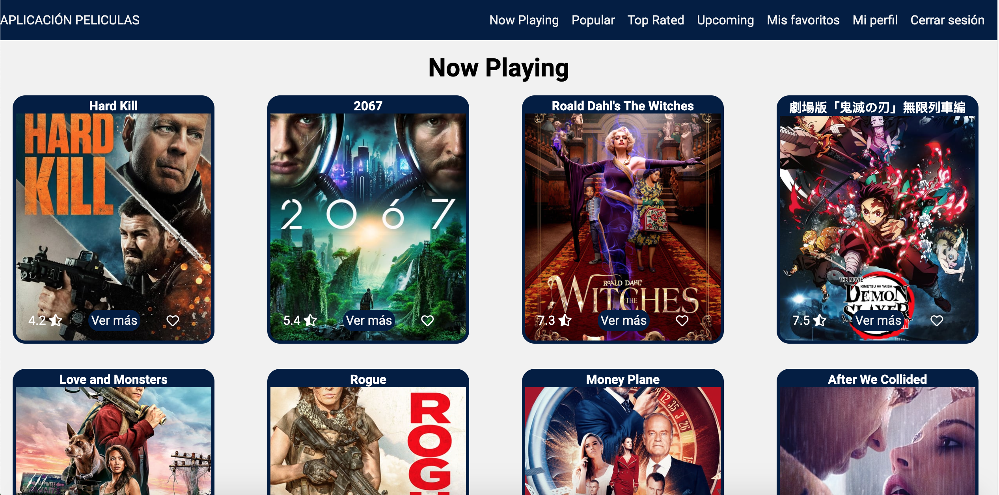

# 💻 Prueba técnica

Prueba técnica, permite loguearse y ver un catalogo de peliculas, puedes agregar o quitar de favoritos.



## 🛠 Scripts

```bash
# Instalar dependencias
$ npm install

# Encender servidor de desarrollo en localhost:3000
$ npm start

# Crear version de producción
$ npm run build

```

## 💎 Tecnologías

- ReactJS
- React Hooks
- Redux
- Axios
- Styled components
- Local Storage

## 💣 Despliegue

https://wizardly-montalcini-08d27d.netlify.app/
